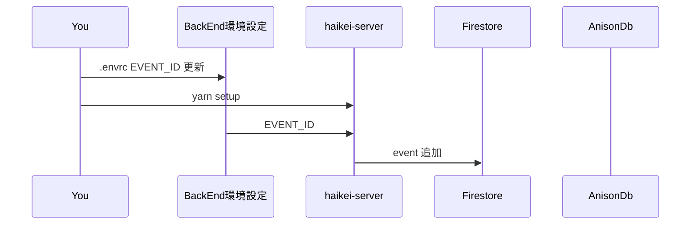
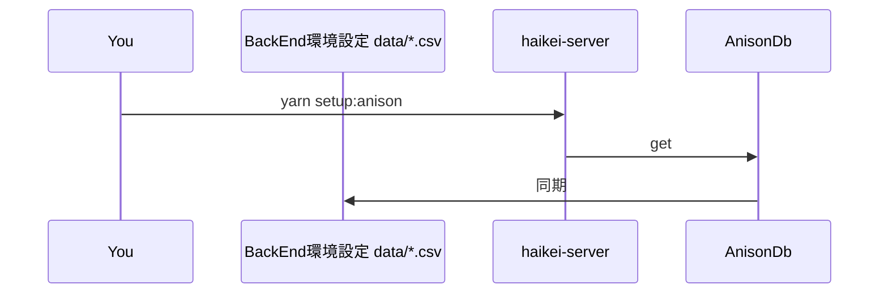
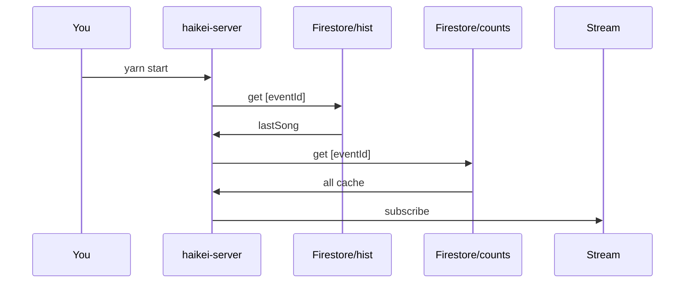
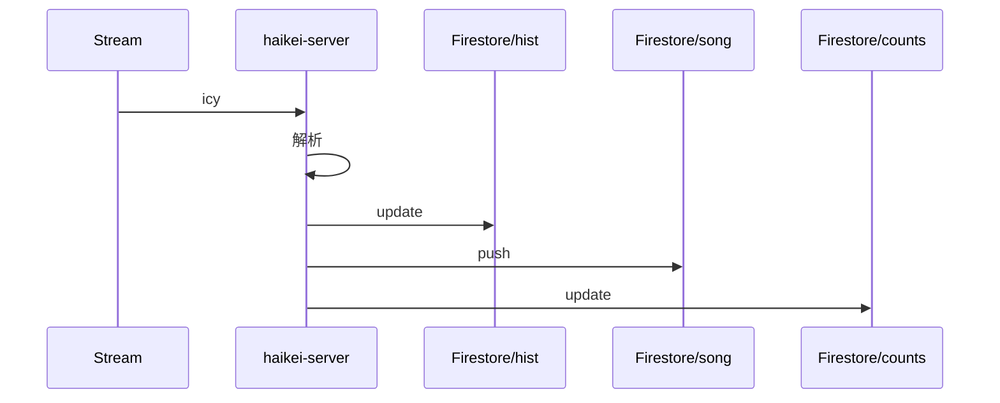

## メンテフロー

### Event 作成

```
$ vi .envrc EVENT_ID
EVENT_ID=xxxxxx
$ yarn setup			 		# EVENT_ID から動作
$ yarn setup:anison
$ yarn ps 					# 確認
```





### FrontEnd のセットアップ

rekka-haikei の `src/config/index.ts`

- イベント追加 `xxxxxx`
- 終了時間指定

### サーバー起動

```
yarn start
yarn osiris   # 保険のicyログ
```



### 動作中



### 終了

アーカイブする。
イベント中の履歴は Firestore からロードするが、アーカイブ後は履歴を Cloud Storage からダウンロードするようになる。

```$$ $$
yarn close:archive {event_ia}
```
