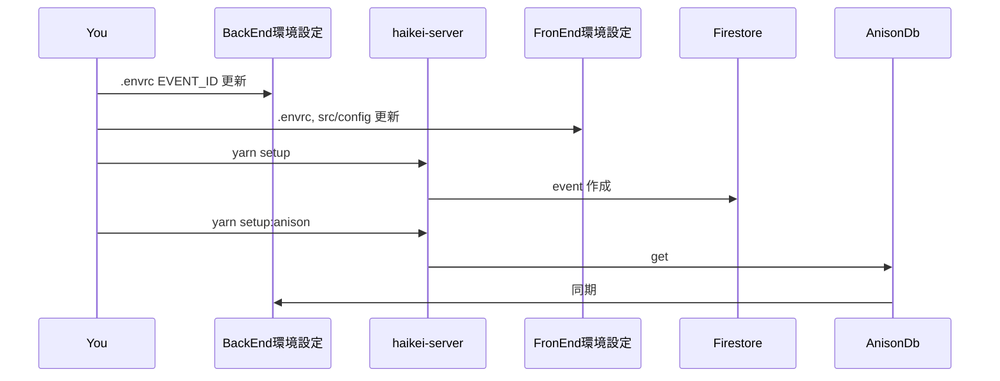
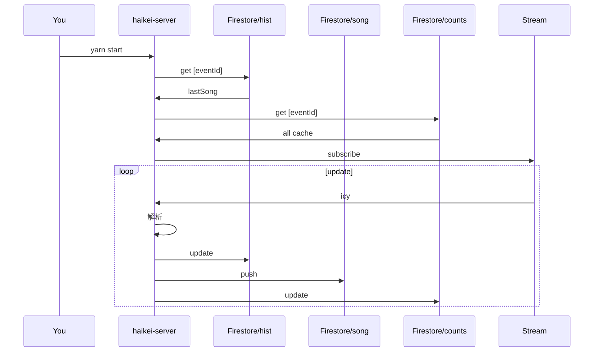

- [フロントエンド vipzero/rekka-haikei](https://github.com/vipzero/rekka-haikei)
- [運用コストメモ](https://github.com/vipzero/haikei-server/wiki/運用メモ)

## setup

```
cp .envrc.sample .envrc
```

## アニメ番組情報の取得

data に アニソンメタデータ設置

http://anison.info/data/download.html

```
data
├── anison.csv
├── game.csv
├── program.csv
└── sf.csv
```

### 背景画像の取得

- Google Search Engine 作成
- Google Custom Search API key 取得

参考記事: https://blog.wackwack.net/entry/2017/12/26/211044

### ここまでの全体履歴の保存

```
node script/importHistory.js
yarn get_history
```

### アルバム情報の取得

iTunes API (認証なし)

小さいアートワーク・アルバム名・copyright

## 使おうとして使ってない module

- spotify: アートワーク・アルバム名・(邦楽・アニソンあまり取れないため)
- musixmatch: アートワーク・アルバム名・歌詞の出だし(有料 API では FULL)

調整・アルゴリズム関係

## 画像検索文字列の生成部分

方針

- 関連性のあるものが出るように
- meme やキャプ画像が出るように
- 平凡な公式タイトル画像以外が出るように

コード

https://github.com/vipzero/haikei-server/blob/main/src/utils/makeSearchWord.ts

## 画像選択

imagemin などで Optimize 後のメタデータで  
ソートして上から 3 つ

コード

https://github.com/vipzero/haikei-server/blob/main/src/imageIo/uploadManage.ts

## フロー

### Event 作成



FrontEnd のセットアップ

- rekka-haikei の `src/config/incdex.ts`
- 開始時間・終了時間
- (必要であれば) `Address.tsx` のリンク・`firebase.json` のリダイレクト

### 動作中


